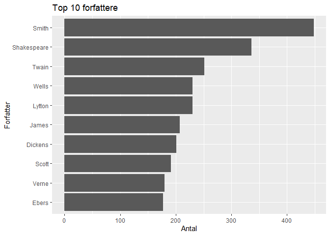
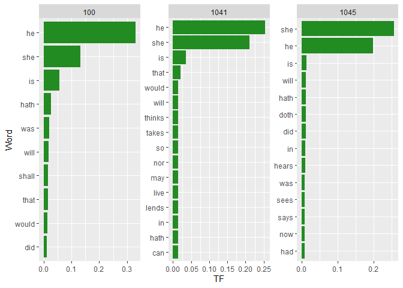

Untitled
================

# 3a

## Libs

``` r
library(stringr)
library(tidytext)
```

    ## Warning: pakke 'tidytext' blev bygget under R version 4.5.3

``` r
library(dplyr)
```

    ## 
    ## Vedhæfter pakke: 'dplyr'

    ## De følgende objekter er maskerede fra 'package:stats':
    ## 
    ##     filter, lag

    ## De følgende objekter er maskerede fra 'package:base':
    ## 
    ##     intersect, setdiff, setequal, union

``` r
library(ggplot2)
```

    ## Warning: pakke 'ggplot2' blev bygget under R version 4.5.2

``` r
library(gutenbergr)
```

    ## Warning: pakke 'gutenbergr' blev bygget under R version 4.5.3

## Aggregering

``` r
gutmeta <- gutenberg_metadata

gutmeta$efternavn <- str_extract(gutmeta$author, "^[^,]+(?=,)|^NA$")

top_forfattere <- gutmeta %>% 
  filter(!is.na(efternavn)) %>% 
  group_by(efternavn) %>% 
  count()

top_forfattere <- as.data.frame(top_forfattere)

colnames(top_forfattere) <- c("efternavn", "antal")

top_forfattere <- top_forfattere %>% 
  arrange(desc(antal)) %>% 
  slice(1:10)
```

## plot

``` r
ggplot(top_forfattere, aes(x = reorder(efternavn, antal), y = antal)) +
  geom_col() +
  coord_flip() +
  labs(x = "Forfatter", y = "Antal", title = "Top 10 forfattere")
```

<!-- -->

# 3b

## Find en mandlig forfatter fra listen og hent et eller flere af hans værker

``` r
sp <- gutmeta %>% filter(efternavn=="Shakespeare")
sp <- sp[1:3,]

sp_text <- gutenberg_download(c(100, 1041, 1045))
```

    ## Using mirror https://gutenberg.pglaf.org.

## Bigrams

``` r
library(tidytext)
library(tidyr)

sp_bigrams <- sp_text %>%
  unnest_tokens(bigram, text, token = "ngrams", n = 2) %>% #bigrams i starten er bare hvad kolonnen kommer til at hedde.
  filter(!is.na(bigram))

bigrams_separated <- sp_bigrams %>%
  separate(bigram, c("word1", "word2"), sep = " ")

he_she <- bigrams_separated %>% 
  filter(word1 %in% c("he", "she") | word2 %in% c("he", "she"))
```

## wc

``` r
word_counts <- he_she %>%
  unnest_tokens(word, word2) %>%
  filter(!str_detect(word, "\\d")) %>% #fjerner alle ord med tal
  count(gutenberg_id, word, sort = TRUE) 


shake_tf_idf <- word_counts %>%
  bind_tf_idf(word, gutenberg_id, n) %>%
  arrange(desc(tf_idf))


shake_tf_idf %>%
  group_by(gutenberg_id) %>%
  slice_max(tf, n = 10) %>%
  ungroup() %>%
  mutate(word = reorder_within(word, tf, gutenberg_id)) %>%
  ggplot(aes(x = word, y = tf)) +
  geom_bar(stat = "identity", fill = "forest green") +
  facet_wrap(~ gutenberg_id, scales = "free") +
  scale_x_reordered() +
  coord_flip() +
  labs(x = "Word", y = "TF")
```

<!-- -->
